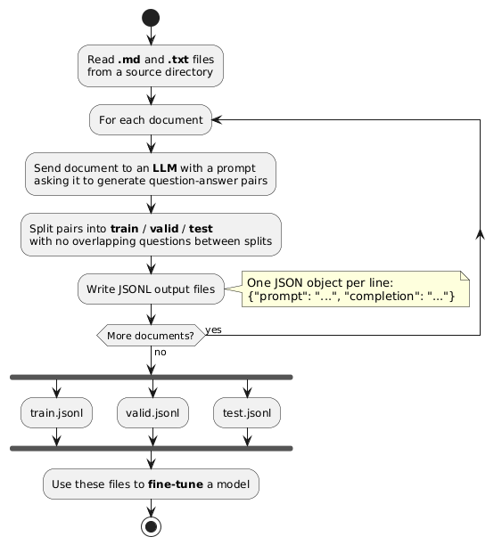

I've been keen to have a play with fine-tuning a local LLM for a little while now, and something I've wanted is the ability to easily turn documentation into training data. Ultimately, I'd like to turn documention into an LLM so you can use it as a local expert without needing RAG, but the first step is creating the training data to make that possible, so I created [datakeg](https://github.com/danmurf/datakeg), a small CLI tool which helps synthasise training data. 

The tool itself was built using Claude and MiniMax M2, with [GSD](https://github.com/glittercowboy/get-shit-done) managing the project. It currently supports Ollama and OpenRouter, which give enough options covering different cost/value scenarios to get this to work.

Here's a rough breakdown of the flow:



So let's take the project [README](https://github.com/danmurf/datakeg/blob/main/README.md) as an example. 

`datakeg generate ./testdoc ./output --provider=openrouter --model=gpt-oss-120b`

Here we have the `README.md` in a folder called `testdoc` , and we're going to put the output in an `output` folder. The default provider is Ollama, but I'm going to use `OpenRouter` for this with `gpt-oss-120b`. 

It will then run through each file in the folder (just one file, for this example) and generate the pairs:

```sh
[1/1] Processing: README.md (7954 chars)
     → Target: 72 train, 24 valid, 24 test pairs
     → Generating train pairs...
     → Train: 72 pairs generated
     → Written 72 pairs to README_train.jsonl
     → Generating valid pairs (excluding 72 train pairs)...
     → Valid: 24 pairs generated
     → Written 24 pairs to README_valid.jsonl
     → Generating test pairs (excluding 96 train+valid pairs)...
     → Test: 24 pairs generated
     → Written 24 pairs to README_test.jsonl
```

If there were more files, it would do the same for each file, and then merge them into one set at the end. After this, we get:

`train.jsonl`

```jsonl
{"prompt":"What file types does datakeg automatically process?","completion":"Markdown (.md) and text (.txt) files."}
{"prompt":"Which LLM providers are supported by datakeg?","completion":"Local Ollama and cloud OpenRouter."}
{"prompt":"What command generates training, validation, and test datasets?","completion":"`datakeg generate`."}
...
```

We also get a validation file, which shouldn't contain any overlapping pairs with the training data:

`valid.jsonl`

```jsonl
{"prompt":"Which flag (including its short form) lists the available built‑in conversion templates in the `convert` command?","completion":"`-l` or `--list-templates`."}
{"prompt":"What is the default value for the `--provider` flag, and which LLM backend does it refer to?","completion":"The default value is `ollama`, which refers to the local Ollama backend."}
{"prompt":"Which built‑in template transforms chat‑format data into a representation that uses `\u003c|im_start|\u003e` tags?","completion":"The `chatml` template."}
...
```

And finally, a testing file, which shouldn't contain any overlapping pairs with either of the training of validation data:

`test.jsonl`

```jsonl
{"prompt":"Which flag can a user supply to the `convert` command to ensure a file generated in the `reasoning` format is correctly interpreted, even if the file name gives no hint about its format?","completion":"The `--source-format reasoning` flag."}
{"prompt":"If the source directory contains a PDF file alongside .md files, how does datakeg treat the PDF during generation?","completion":"It ignores the PDF because datakeg only processes markdown (.md) and text (.txt) files."}
{"prompt":"If a user runs `datakeg generate --format reasoning --reasoning-format separate`, what JSON fields will each output record contain, and how does this differ from using `integrated`?","completion":"The record will have `question`, `reasoning`, and `answer` fields; with `integrated` the record would have `prompt` and `completion` fields, with the reasoning embedded inside the `completion` value."}
...
```

The tool has a setting for how much data to generate per 1k characters. The default is 10 pairs per 1k chars, but this may need tweaking depending on the structure / density of information in the document. You can also configure the split ratio of training/validation/testing data.

The tool is very much a work in progress and not ready for production, but if you want to have a play with synthesising training data it's a good place to start.

To find out more, or give it a go yourself, checkout the project at https://github.com/danmurf/datakeg

