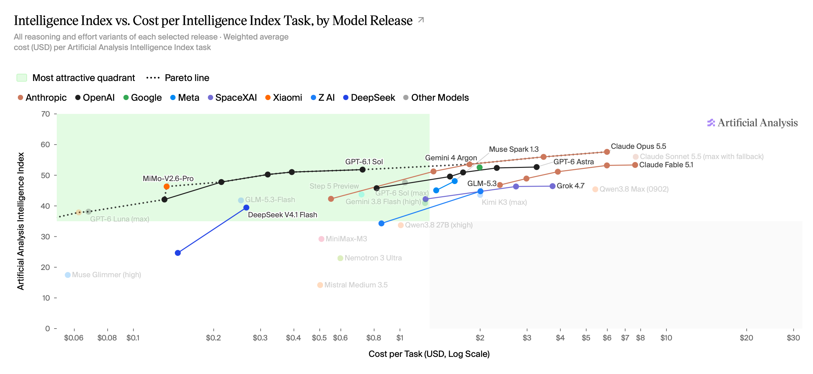

The pace of the frontier seems to be picking up rapidly over the last few months. Most mornings I'll wake up and check my phone and there's been another breakthrough overnight and the new best model has changed yet again. One thing that's usually quite common when a new model is released is the provider will often show off the new benchmarks, highlighting their higher numbers compared to some of their other models or competitors. I feel like this act of showing off the benchmarks all the time is drumming into people: "This one is the best, you need to use this one, and if you don't, you're missing out." However, if you're doing a task that doesn't require a high level of intelligence, switching up the model tier will often result in either marginal or no gain at all, but it might result in you paying more for effectively the same output.

Source: https://artificialanalysis.ai/#release-comparison-tabs

This graph shows a slightly different picture. It has the intelligence index on the y-axis, so obviously higher is better. But it's also shown against the cost per task on the x-axis, where to the right is more expensive. Note that this increases exponentially as it moves over to the right, so a small gain in intelligence upwards may result in a massive increase in the cost of that task. This is why the top left quadrant is highlighted green, since this is the sweet spot of a high level of intelligence and a low cost per task.

You can see Claude Opus 5.5 and Claude Fable 5.1 right over to the top right. Although, according to these benchmarks, these are the most intelligent models, you can see that you're paying roughly $8 per task. Whereas if you have a look at GPT 6.1 Sol, it's around the same level of intelligence, but you're only paying 80 cents per task.

I think this is why it's worth paying attention to the type of task that you need to perform and the level of intelligence you require for that task. Even if money isn't the issue, you're still going, potentially, to burn through your usage much faster if you use a higher level of intelligence than you need for that task.

Let's say you have a task to write an SQL migration to add a new table for a new entity that you want to store. If you've put the effort into planning the data model out and you know the schema, then writing the migration is fairly deterministic. Selecting a more intelligent model isn't necessarily going to produce a better migration; it will just produce the same migration for a bigger cost. Therefore, it's worth experimenting with choosing a smaller model, which will be able to deliver the same output but at a much lower cost per task.

I'm using a migration as an example here, since I think it's probably one of those tasks where the end result is fairly deterministic. But there's a lot of other tasks in software engineering where the end result is reasonably deterministic, especially if you have well established patterns in your code base. For example, adding a new endpoint or adding a new repository method. You can probably already see the code that needs to be written in your head. You know the test cases that need to be set up, all of the boilerplate, and maybe even some of the logic. The change just needs to be manifested into a set of diffs.

If you're planning a large piece of work, and in order to perform the planning you need to scour the code base, dig into lots of nuance and technical requirements, ask lots of questions, take lots of things into consideration, then maybe picking a bigger model is right for this task. You can then store the output of this planning in a markdown file, and have smaller models pick up the pieces if you're able to break the work down into small deterministic chunks.

When it comes to code review, maybe you want to up the model intelligence slightly so that it can look at the bigger picture in line with the change. But again, maybe it doesn't need the absolute top-level model for this.

So rather than driving everywhere in first gear, I think it's worth experimenting and finding which is the right model for the task that you're trying to perform. This will help you keep as close to the top left quadrant for the majority of your work. Your usage will go further, you'll spend less, and you may end up getting the work done a lot faster.